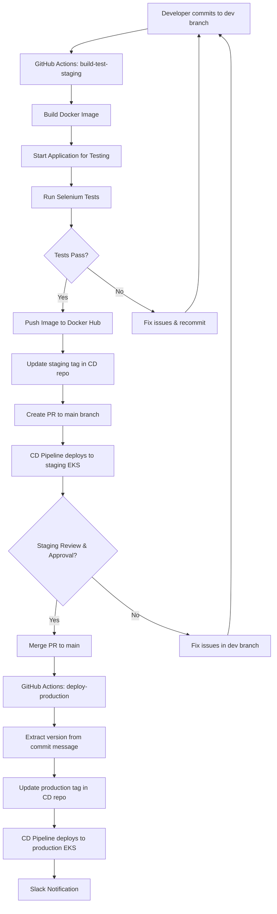

# Welcome to the Source Application Repository

This repository contains a Next.js web application built with TypeScript and MongoDB. The application features containerization with Docker and automated CI/CD workflows for seamless deployment to staging and production environments on AWS EKS.

## 🚀 Technology Stack

- **Frontend/Backend**: Next.js with TypeScript
- **Database**: MongoDB with MongoDB Atlas
- **Authentication**: NextAuth.js with Google OAuth
- **Containerization**: Docker
- **CI/CD**: GitHub Actions
- **Container Registry**: Docker Hub
- **Deployment**: AWS EKS (Kubernetes)

## 🏗️ Architecture Overview

This repository follows a GitOps deployment pattern with automated testing, staging, and production environments:



## 📋 Prerequisites

- Docker and Docker Compose
- Node.js 18+ (for local development)
- MongoDB Atlas cluster or local MongoDB instance
- Google OAuth credentials (for authentication)

## 🚀 Getting Started

### Local Development

1. **Install dependencies**

   ```bash
   npm install
   ```

2. **Run development server**

   ```bash
   npm run dev
   ```

3. **Access the application**
   Open [http://localhost:3000](http://localhost:3000) in your browser

### Docker Development

1. **Build and run with Docker Compose**

   ```bash
   docker-compose up --build
   ```

2. **Access the application**
   Open [http://localhost:3000](http://localhost:3000) in your browser

### Useful Docker Commands

- **Start application**: `docker-compose up`
- **Stop application**: `docker-compose down`
- **Rebuild container**: `docker-compose up --build`
- **View logs**: `docker-compose logs -f`
- **Run in background**: `docker-compose up -d`

## 🔄 CI/CD Workflow

### Development & Staging Flow

1. **Create feature branch** from `dev`
2. **Make changes** and commit to `dev` branch
3. **Push to dev branch** - this triggers the `build-test-staging` job:
   - Builds Docker image with run number as version tag
   - Starts application in test environment
   - Runs Selenium automated tests
   - If tests pass: pushes image to Docker Hub
   - Updates staging version in CD repository (`values-staging.yaml`)
   - Creates Pull Request to merge `dev` → `main`
   - Triggers CD pipeline to deploy to staging EKS

### Production Deployment

1. **Review and test** staging deployment
2. **Merge PR to main** - this triggers the `deploy-production` job:
   - Extracts version number from commit message (format: `@123`)
   - Updates production version in CD repository (`values-production.yaml`)
   - Triggers CD pipeline to deploy to production EKS
   - Sends Slack notifications about deployment status

### Branch Strategy

- **dev**: Development branch for new features and fixes
- **main**: Production-ready code, protected branch
- **Pull Requests**: Required for merging dev → main

## 📁 Project Structure

```
├── components/          # Reusable React components
├── app/                 # Next.js App Router pages and layouts
├── pages/              # Next.js pages and API routes
├── utils/              # Utility functions and helpers
├── hooks/              # Custom React hooks
├── models/             # MongoDB models and schemas
├── public/             # Static assets
├── styles/             # CSS and styling files
├── types/              # TypeScript type definitions
├── selenium-tests/     # Automated testing with Selenium
├── docker-compose.yml  # Docker Compose configuration
├── Dockerfile          # Container configuration
├── next.config.js      # Next.js configuration
├── .env               # Environment variables
├── package.json        # Dependencies and scripts
└── tsconfig.json       # TypeScript configuration
```

## 🐳 Docker Configuration

The application uses a multi-stage Docker build:

- **Development stage**: Installs all dependencies
- **Production stage**: Optimized runtime image

Key features:

- Health checks for container monitoring
- Non-root user for security
- Optimized layer caching
- Production-ready configuration

## 🔐 Environment Variables

| Variable                | Description                     | Required |
| ----------------------- | ------------------------------- | -------- |
| `MONGODB_URI`           | MongoDB connection string       | Yes      |
| `GOOGLE_ID`             | Google OAuth client ID          | Yes      |
| `GOOGLE_CLIENT_SECRET`  | Google OAuth client secret      | Yes      |
| `NEXTAUTH_SECRET`       | NextAuth session encryption key | Yes      |
| `NEXTAUTH_URL`          | Application base URL            | Yes      |
| `NEXTAUTH_URL_INTERNAL` | Internal NextAuth URL           | Yes      |

## 🧪 Testing

The project includes automated testing with Selenium:

### Selenium Tests

```bash
# Install test dependencies
cd selenium-tests
pip install -r requirements.txt

# Run tests locally
pytest test_simple.py --verbose
```

### CI/CD Testing

- **Automated Testing**: Selenium tests run automatically on every `dev` branch commit
- **Docker Testing**: Application is tested in containerized environment
- **Health Checks**: Application readiness verified before tests run

### Manual Testing

```bash
# Run tests manually
npm run test

# Run tests in watch mode
npm run test:watch

# Run tests with coverage
npm run test:coverage
```

## 🚀 Deployment

Deployments are fully automated through GitHub Actions:

### GitHub Actions Jobs

**build-test-staging** (runs on `dev` branch):

- Builds and tags Docker image with run number
- Starts application in test environment
- Runs Selenium automated tests
- Pushes image to Docker Hub if tests pass
- Updates staging configuration in CD repository
- Creates Pull Request for production deployment

**deploy-production** (runs on `main` branch):

- Extracts version from commit message (requires `@version` format)
- Updates production configuration in CD repository
- Triggers production deployment

**notify** (runs after other jobs):

- Sends Slack notifications to `#devops` channel
- Includes deployment status and application URLs

### Required Secrets

Configure these secrets in your GitHub repository:

| Secret              | Description                           |
| ------------------- | ------------------------------------- |
| `DOCKER_USERNAME`   | Docker Hub username                   |
| `DOCKER_PASSWORD`   | Docker Hub password/token             |
| `GITOPS_TOKEN`      | GitHub token for CD repository access |
| `SLACK_WEBHOOK_URL` | Slack webhook for notifications       |

### Manual Deployment Commands

Manual deployment is handled by the CD repository, but you can trigger deployments by:

- **Staging**: Push to `dev` branch
- **Production**: Merge PR to `main` with version in commit message (e.g., "Fix bug @123")

## 📊 Monitoring

The application includes:

- Health check endpoints
- Container health monitoring
- Application logging
- Performance metrics

## 🤝 Contributing

1. Create a feature branch from `dev`
2. Make your changes and test locally
3. Push to `dev` branch to trigger automated testing and staging deployment
4. Review staging deployment and ensure tests pass
5. Merge the automatically created PR to `main` for production deployment
6. Ensure your merge commit includes version number (e.g., "Merge feature @123")

## 🆘 Troubleshooting

### Common Issues

**Docker build failures**

- Check Docker daemon is running
- Verify environment variables are set
- Clear Docker cache: `docker system prune -a`

**Database connection issues**

- Verify MongoDB URI format
- Check network connectivity
- Ensure MongoDB Atlas IP whitelist includes your IP

**Authentication problems**

- Verify Google OAuth credentials
- Check NEXTAUTH_SECRET is set
- Ensure callback URLs are configured correctly

## 📚 Additional Resources

- [Next.js Documentation](https://nextjs.org/docs)
- [MongoDB Documentation](https://docs.mongodb.com/)
- [NextAuth.js Documentation](https://next-auth.js.org/)
- [Docker Documentation](https://docs.docker.com/)
- [AWS EKS Documentation](https://docs.aws.amazon.com/eks/)

## 📞 Support

For issues and questions:

- Check the troubleshooting section above
- Review GitHub Issues
- Contact via email: omerbenda98@gmail.com

---

**Note**: This repository contains the source code. For deployment configurations and infrastructure, see the companion CD repository.
uitopia-cd repository: https://github.com/omerbenda98/uitopia-cd.git
